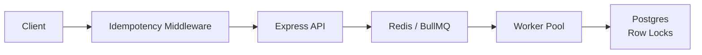

# Settlement Engine

## Architecture



## Run locally

From the repository root, start the infrastructure with:

```bash
docker compose -f server/docker-compose.yml up --build --scale worker=2
```

This starts one Node.js API process and two worker processes. All services read their shared configuration from `server/.env`.

For running the API and worker directly instead of Docker:

```bash
cd server && npm install && npm run build && npm start
cd server && npm run worker
```

The API exposes `GET /health` for a liveness check and `GET /metrics` for request latency percentiles, database pool statistics, and Redis memory usage.
